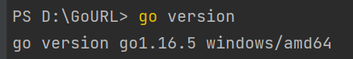

# 1.3 包管理

## 1.3.1 包管理重要性

很多语言/系统都有用于安装/管理包的方法。Java的Mavan、Python的Pip、JavaScript的npm、Go的God、Centos的Yum、Ubuntu的Apt等等。个人觉得，如果想实现一个大型的、具有工程实际使用价值的软件，肯定离不开包管理工具（C/C++除外）。

## 1.3.2 Go的包管理:Go mod

不打算介绍Go历史上的包管理工具，直接一步到位介绍现在官方推荐的Go mod方式。

- 确认所用Go版本
  Go 在1.11版本之后将Go mod 方式作为官方实验，1.13版本之后，默认开启Go mod。所以，在使用Go mod之前，首先需要确认自身环境的Go语言版本。
  在命令行中，执行`go version`,即可显示相关版本信息。
  本人Go版本信息：
  
- Go mod 命令三板斧
  Go mod 的命令很多，但是我觉得下面三条命令是最常用也最应该掌握的。

```bash
    go mod init   // 初始化 go.mod，将开启 mod 使用
    go mod tidy   // 添加或者删除 modules，取决于依赖的引用
    go mod vendor // 复制依赖到 vendor 目录下
```

- Go mod 其他命令
  Go mod 其他常见的命令也很多，再次列出部分。

```bash
    go mod download  // 下载 module 到本地
    go mod edit     //  编辑 go.mod
    go mod graph    //  打印 modules 依赖图
    go mod verify   //  验证依赖
    go mod why      //  解释依赖使用
```

## 1.3.3 Go mod 实例：以leveldb为例

## 1.3.4 Go mod 使用自己的包

## 链接

- [目录](directory.md)
- 上一节:[环境配置](01.1.md)
- 下一节:[测试]
