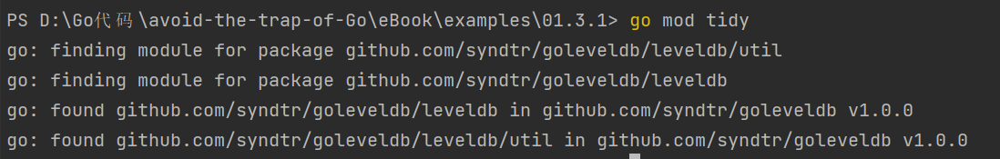
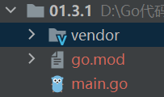

# 1.3 包管理

## 1.3.1 包管理重要性

很多语言/系统都有用于安装/管理包的方法。Java的Mavan、Python的Pip、JavaScript的npm、Go的God、Centos的Yum、Ubuntu的Apt等等。个人觉得，如果想实现一个大型的、具有工程实际使用价值的软件，肯定离不开包管理工具（C/C++除外）。

## 1.3.2 Go的包管理:Go mod

不打算介绍Go历史上的包管理工具，直接一步到位介绍现在官方推荐的Go mod方式。

- 确认所用Go版本
  Go 在1.11版本之后将Go mod 方式作为官方实验，1.13版本之后，默认开启Go mod。所以，在使用Go mod之前，首先需要确认自身环境的Go语言版本。
  在命令行中，执行`go version`,即可显示相关版本信息。
  本人Go版本信息：
  
- Go mod 命令三板斧
  Go mod 的命令很多，但是我觉得下面三条命令是最常用也最应该掌握的。

```bash
    go mod init   // 初始化 go.mod，将开启 mod 使用
    go mod tidy   // 添加或者删除 modules，取决于依赖的引用
    go mod vendor // 复制依赖到 vendor 目录下
```

- Go mod 其他命令
  Go mod 其他常见的命令也很多，再次列出部分。

```bash
    go mod download  // 下载 module 到本地
    go mod edit     //  编辑 go.mod
    go mod graph    //  打印 modules 依赖图
    go mod verify   //  验证依赖
    go mod why      //  解释依赖使用
```

## 1.3.3 Go mod 实例：以leveldb为例

如果大家使用的是GoLand，那么当新建一个项目时候，GoLand将默认使用go mod。本工程的测试代码见：

```code
package _1_3_1

import (
 "fmt"
 "github.com/syndtr/goleveldb/leveldb"
 "github.com/syndtr/goleveldb/leveldb/util"
 "strconv"
)

func main() {
 //创建并打开数据库
 db, err := leveldb.OpenFile("./db", nil)
 if err != nil {
  panic(err)
 }

 defer db.Close() //关闭数据库

 //写入5条数据
 db.Put([]byte("key1"), []byte("value1"), nil)
 db.Put([]byte("key2"), []byte("value2"), nil)
 db.Put([]byte("key3"), []byte("value3"), nil)
 db.Put([]byte("key4"), []byte("value4"), nil)
 db.Put([]byte("key5"), []byte("value5"), nil)

 //循环遍历数据
 fmt.Println("循环遍历数据")
 iter := db.NewIterator(nil, nil)
 for iter.Next() {
  fmt.Printf("key:%s, value:%s\n", iter.Key(), iter.Value())
 }
 iter.Release()

 //读取某条数据
 data, _ := db.Get([]byte("key2"), nil)
 fmt.Printf("读取单条数据key2:%s\n", data)

 //批量写入数据
 batch := new(leveldb.Batch)
 batch.Put([]byte("key6"), []byte(strconv.Itoa(10000)))
 batch.Put([]byte("key7"), []byte(strconv.Itoa(20000)))
 batch.Delete([]byte("key4"))
 db.Write(batch, nil)

 //查找数据
 key := "key7"
 iter = db.NewIterator(nil, nil)
 for ok := iter.Seek([]byte(key)); ok; ok = iter.Next() {
  fmt.Printf("查找数据:%s, value:%s\n", iter.Key(), iter.Value())
 }
 iter.Release()

 //按key范围遍历数据
 fmt.Println("按key范围遍历数据")
 iter = db.NewIterator(&util.Range{Start: []byte("key3"), Limit: []byte("key7")}, nil)
 for iter.Next() {
  fmt.Printf("key:%s, value:%s\n", iter.Key(), iter.Value())
 }
 iter.Release()
}
```

此刻，代码里面应该布满了红色提示，表示没有相关的包。我们需要进行配置。

- 初始化
  
   在项目目录下，执行`go mod init`。此时，应该生成`go.mod`文件。

   ```text
   module 01.3.1
   go 1.16
   ```

- 依赖分析
  
   同样在项目目录下，执行`go mod tidy`，分析代码运行所需依赖。
   
   此刻，`go.mod`和`go.sum`内容也发生了变化，依赖关系已经变更。

   ```text
   module 01.3.1
   go 1.16
   require github.com/syndtr/goleveldb v1.0.0
   ```

- 复制依赖
  
  为了项目可以正常运行，再使用`go mod vendor`。将依赖文件复制到项目空间。


## 1.3.4 Go mod 使用自己的包

## 链接

- [目录](directory.md)
- 上一节:[编译方式](01.2.md)
- 下一节:[测试]
